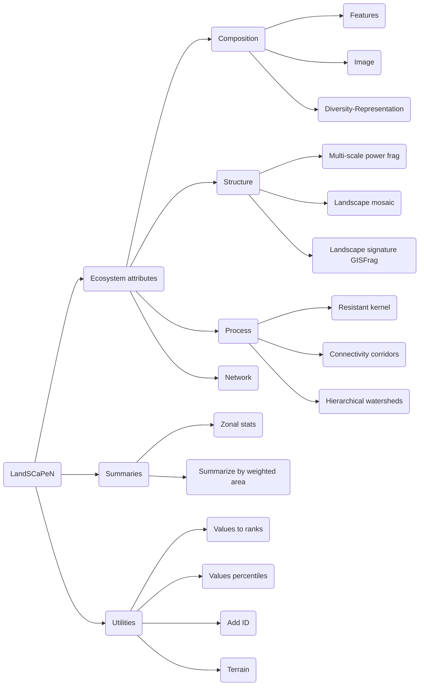

# LandSCaPeN documentation -- under revision!

# LandSCaPeN v0.2, September 18, 2019
 A toolbox to analyze and visualize landscape structure, composition, process, and networks in Google Earth Engine.
 Please cite as: DM Theobald. 2019. *LandSCaPeN v0.2: A Google Earth Engine toolbox to analyze and visualize landscape structure, composition, process, and networks.* [www.davidmtheobald.com](https:davidmtheobald.com).
 The tools are organized into landscape [composition](#comp), [structure](#stru), [process](#proc), [networks](#netw), [utilities](#util), and [visualization](#visu).
 To call LandSCaPeN functions, first load the module into your script through the *require()* function, and then call the function 
 using *lse*. For example:

 var lse = require('users/DavidTheobald8/modules:lse')

 Technical notes:
 + parameters to functions must be in proper order and dictionary format (using {}) is *not* supported.
 ##  Composition functions
 ### lse.compositionFC(fc, propertyClass, propertyValue, propertyWeight)
 Summarizes an attribute (*propertyValue*) for features from a Feature Collection using a property (*propertyClass*) that contains nominal/class data.
+ *fc*: feature collection with polygons, ee.FeatureCollection()
+ *propertyClass*: name of the "class" property in *fc* to summarize on, ee.String()
+ *propertyValue*: name of the "value" property in *fc* that describes the values to summarize. Must contain numerical values, ee.String()
+ *propertyWeight*: name of the property in *fc* used to calculate weighted statistics. Defaults to the *propertyValue*. Must contain numerical values, ee.String()
+ returns: a feature collection with summarized statistics for each unique value in *propertyClass* to Export.table.toDrive.

 Note: when quantifying a summary measure of patch size, it is recommended to use the "meanWeighted" statistic, which is known as Weighted Mean Patch Size ([Li and Archer 1997](https://scholar.google.com/scholar?hl=en&as_sdt=0%2C6&q=weighted+mean+patch+size+li+and+archer&btnG=&oq=weight))
 Also, compositional statistics are also known as Patch Richness and Class Area Proportion [Leitao et al. (2006)](https://scholar.google.com/scholar?hl=en&as_sdt=0%2C6&q=Measuring+Landscapes&btnG=).
 ### lse.compositionImage(image, resolution, region)

 Calculates the area of classes for an image (raster), assuming nominal/class image values.
 These are also known as Class Area Proportion and Patch Richness ([Leitao et al. 2006](https://scholar.google.com/scholar?hl=en&as_sdt=0%2C6&q=Measuring+Landscapes&btnG=)).
 Future plans to include summarizes of patches in each class.

+ *image*: image with integer values representing nominal values, type = ee.Image()
+ *resolution*: size of cells in meters used for sampling image, type ee.Number()
+ *region*: area to calculate, type ee.Geometry()
+ returns: a feature collection with summarized statistics for each class for Export.table.toDrive, ee.FeatureCollection().
 ### lse.uniqueValues(fc, property)
 Summarizes a feature collection and provides a list of the unique values for a given property.
+  *fc*: ee.FeatureCollection(), the feature collection with >0 features to summarize.
+  *property*: ee.String(), the property (aka field) contained in the FeatureCollection with either integer or string values.
+  returns a list of the unique values in a given property, type ee.List().
 ##  Structural functions
 ### lse.landscapeMosaic(landCover, lstRemap, radius)
 Calculates and visualizes the landscape mosaic, as described by [Riitters et al. (2009)](https://scholar.google.com/scholar?hl=en&as_sdt=0%2C6&q=Riitters%2C+K.+H.%2C+Wickham%2C+J.+D.%2C+%26+Wade%2C+T.+G.+%282009%29.+An+indicator+of+forest+dynamics+using+a+shifting+landscape+mosaic&btnG=)
 Note that water is considered as null.
+ *landCover*: the desired land cover dataset
+ *lstFrom*, a list with classes from the raw land cover map, ee.List()
+ *lstTo*, a list with classes from the raw land cover map, ee.List()
+ + For example, for NLCD: var lstFrom = [11,12,21,22,23,24,31,41,42,43,52,71,81,82,90,95]
+ +                        var lstTo =   [ 3, 3, 2, 2, 2, 2, 3, 3, 3, 3, 3, 3, 1, 1, 3, 3]
+ *radius*: the radius of moving window in meters, type ee.Number()
+ returns mosaic image and draws the landscape mosaic in the map window.
 ### lse.landscapeSignature(patches, resolution, maxDistance, geometry)
 This function characterizes the structure within patches as well as between patches (landscape level), following [Theobald (2003)](https://scholar.google.com/scholar?hl=en&as_sdt=0%2C6&q=Theobald%2C+DM+GIS+Concepts+and+ARCGIS+Methods&btnG=)
+ *habitat*: a binary representation of habitat (0=matrix, >0 is "patch"), type: ee.Image()
+ *resolution*: the size of pixels in meters, ee.Number()
+ *maxDistance*: the maximum distance to calculate distance from the nearest patch, ee.Number()
+ *AOI*: user-defined area of interest summarized by histogram, type: ee.Geometry()
returns: image with distance into patch ("core") and away from (into "matrix")'
+ Note: this is similar to "GISFrag" metric: [Ripple et al. (1991)](https://scholar.google.com/scholar?hl=en&as_sdt=0%2C5&q=Measuring+forest+landscape+patterns+in+the+cascade+range+of+Oregon%2C+USA&btnG=).
 ## Process functions
 ### lse.connectivityResistantKernel(fc, resistance, resolution, maxDistance, tileScale)

 Calculates landscape connectivity using "kernels" (typically regularly-spaced) calculated using cost-distance 
 across a *resistance* surface. [Compton et al. (2007)](https://scholar.google.com/scholar?hl=en&as_sdt=0%2C5&q=compton+resistant+kernel&btnG=)

+ *fc*: the locations (usually points) to center kernels. ee.FeatureCollection()
+ *resistance*: resistance surface used to calculate cost-distance; ee.Image()
+ *resolution*: the resolution of output image in meters; ee.Number()
+ *maxDistance*: the maximum Euclidean distance (meters) used to calculate cost-distance; ee.Number(). NOTE: to calculate the dispersal
+   kernel, the distance at which the dispersal probability is set to 1% chance at the maxDistance,
+   but applied to the ecological (cumulative cost) distance (e.g., 1% chance of reaching 100 km, theta=0.0000461). 
+   Therefore, the resulting dispersal probabilities need to be interpreted carefully, and typical in relative terms, 
+   because the dispersal kernel is applied to cost-distance units.
+ *tileScale*: typically a value of 1 (nominal scale), but use 2 or 4 if computational limits; ee.Number()
+ returns connectivity image named "DispersalMean", ee.Image().
### lse.connectivityWatersheds(values, lstFCs, statistic, resolution)
  Estimates up and downstream connectivity by calculating a statistic on values that are within each watershed, at multiple hierarchical watershed levels.
+ *values*: image with values to summarize by watershed, ee.Image().
+ *lstFCs*: a list of the Feature Collections that contain watersheds at different levels, ee.List().
+ *statistic*: ee.String(), supported: 'max', 'mean', 'median', 'min', 'mode', 'stdDev', 'sum'. Defaults to 'mean'.
+ *resolution*: ee.Number()
 ## Utility functions
### lse.valuesToRanks(values, extent, resolution, start, end, increment)
  Converts values in an image to the rank order.
+ *values*: an image with continuous (real) values to be ranked, ee.Image()
+ *extent*: geographic extent to analyze, ee.String().
+ *resolution*: width of a pixel, in meters. ee.Number()
 ### lse.summarizeZones(values, zones, lstStatistics, resolution, extent)
 Summarizes the values from an image (*values*) within *zones* specified by a FeatureCollection.
 Each statistic in the *lstStatistics* is calculated for each zone at the *resolution* specified. 
 *values* = ee.Image()
 *zones* = the zones or regions used to summarize over. Can be either ee.FeatureCollection() or ee.Image()
 *lstStatistics* = ee.List() of strings that can include: 'deciles', 'max', 'mean', 'median', 'min', 'percentiles','quartiles', 'skew', 'stdDev', 'sum', 'variance'
 *resolution* = ee.Number()
 *extent* = ee.Geometry()
 returns ee.FeatureCollection()
 ### lse.deleteListOfAssets(lst)
 *lst* = list of asset Ids to be deleted
 returns null 
 ### lse.ingestListOfAssets(lst)
 *lst* = list of asset Ids to be ingested
 returns null 
 ### lse.getListOfAssets(folder, match, type)
 *folder* = asset folder to get list. Do not include finishing '/'. ee.String()
 *match* = string of characters to match in the list of assetIds. ee.String()
 *type* = type of asset, either: "Table" or "Image". ee.String()
 returns ee.List() 
 ### lse.chili(fc, dem, resolution, dayOfYearStart, dayOfYearEnd)
 Calculates the Continuous Heat-Insolation Load Index for pixels specified by *fc* using 
 elevation data from *dem* at the specified *resolution*. 
 A range of CHILI values will be provided, from *dayOfYearStart* to *dayOfYearEnd*. ***Not implemented yet***
 *fc* = ee.FeatureCollection()
 *dem* = ee.Image()
 *resolution* = ee.Number()
 *dayOfYearStart* = ee.Number(), Julian day from 0 to 365, will wrap the year's end if needed.
 *dayOfYearEnd* = ee.Number(), Julian day from 0 to 365, will wrap the year's end if needed.
 returns ee.FeatureCollection 
 ### lse.snapImage(resolutionMeters, extent)
 This function returns parameters for input into Export.image() used to snap an image
 to a common origin, and calculates an integer number of pixels for the specified extent and resolution (following Matt Hancher's example)
 Assumes WGS84 ('EPSG:4326') coordinates.
+ *resolutionMeters*: the approximate meters of a cell width at the equator such that the image tiling fits perfectly within the extent. ee.Number()
+ *extent*: If 'global' then extent is set so top left is [-180, 80] and bottom right is [180,-80].
+  If 'CONUS' then extent is for conterminous US that nestles in a global raster of the same resolution, where top left = [] and bottom right = []
+ *image*: image with integer values representing nominal values, type = ee.Image()
+ returns ee.List(numbers): the adjusted *pixelsPerDegree* and *degreesPerPixel*, the origin's *western longitude* and *northern latitude*, the 
++    image dimensions in number of pixels (*width*, *height*), and approximated meters per pixel.
 ### lse.imageSampling(resolution, spacing)
 Returns an image with samples of size *resolution* meters spaced every 1/*intensity* pixels
 Assumes WGS84 ('EPSG:4326') coordinates.
+ *resolution*: the approximate meters of a cell width at the equator, ee.Number()
+ *intensity*: samples every Nth pixel, ee.Number()
+ *sampleType*: for uniform grid use 'uniform' or 'random' for simple random sample, ee.String()
+ *seed*: seed for the random number generator (only applies to 'random' type), ee.Number(), integer
+ returns ee.Image(integer), 1=sample locations, 0=background
 ### lse.meters2dd(meters, latitude)
 Converts input *meters* to decimal degrees, at a given *latitude*.
 + *meters*: ee.Number(), the scale of pixels in meters (along each side of a pixel)
 + *latitude*: ee.Number(), the latitude in degrees where the width of a pixel should be measured
 + returns: ee.Number(), the decimal degrees at specified latitude
 ### lse.dd2meters(dd, latitude)
 Converts input *dd* to meters, at a given *latitude*.
 + *dd*: ee.Number(), the scale of pixels in decimal degrees (along each side of a pixel)
 + *latitude*: ee.Number(), the latitude in degrees where the width of a pixel should be measured
 + returns: ee.Number(), the meters at specified latitude
 ### lse.lstst50()
 Provides a list of the US state abbreviations in lower case (e.g., Colorado is 'co')
 +returns: ee.List()
 ### lse.lstst50()
 Provides a list of the US state abbreviations in upper case (e.g., Colorado is 'CO')
 + returns: ee.List()
 ### lse.HUC2()
 Provides a list of strings that contain the hydrologic unit codes at the 2nd code level (e.g., upper Colorado River basin is '14')
 + returns: ee.List()
 ##  Visualization functions
 ### lse.colorPalette(name, numClasses)
 Provides a color palette based on popular color ramp schemes.
 + *name*: ee.String(), name of color ramp. Currently supports : "viridisCividis", "viridisInferno", "viridisMagma", and "viridisViridis". See: https://cran.r-project.org/web/packages/viridis/vignettes/intro-to-viridis.html
 + *numClasses*: ee.Number(), the number of discrete colors from 2 to 10
 + returns: ee.String() in palette form
 ### lse.visualizeNodes(nodes, sizeProperty, colorProperty, lstPtSizes, lstPtSizeBreaks, color)
 Display circles centered at *nodes* with radius in cells calculated as *sizeProperty* with *lstPtSizeBreaks* applied to the size property, displayed using circles of *lstPtSizes*.
+ *nodes*: ee.FeatureCollection()
+ *sizeProperty*: ee.String(), property that contains a numerical value.
+ *lstPtSizes*: ee.List(), list of integers indicating point sizes associated with class breaks.
+ *lstPtSizeBreaks*: ee.List(), list of values applied to *sizeProperty* to see with class a feature is in.
+ *color*: ee.String(), name of color (e.g., 'red').
+ returns: null
 ### lse.visualizeFeaturesSize(fc, sizeProperty, lstSizes, lstSizeBreaks, colorProperty, lstColors, lstColorBreaks)
 Display edges (lines) with width measured in cells calculated on *sizeProperty* with *lstSizeBreaks* applied to the size property, displayed using *lstSizes*.
+ *edges*: ee.FeatureCollection()
+ *sizeProperty*: ee.String(), property that contains a numerical value to specify width.
+ *lstSizes*: ee.List(), list of integers indicating widths associated with class breaks.
+ *lstSizeBreaks*: ee.List(), list of values applied to *sizeProperty* to see which class a feature is in.
+ *colorProperty*: ee.String(), property that contains a numerical value to specify width.
+ *lstColors*: ee.List(), list of integers indicating widths associated with class breaks.
+ *lstColorBreaks*: ee.List(), list of values applied to *sizeProperty* to see which class a feature is in.
+ returns: null
 ### lse.visualizeFeaturesSize(fc, sizeProperty, lstSizes, lstSizeBreaks, color)
 Display edges (lines) with width measured in cells calculated on *sizeProperty* with *lstSizeBreaks* applied to the size property, displayed using *lstSizes*.
+ *edges*: ee.FeatureCollection()
+ *sizeProperty*: ee.String(), property that contains a numerical value to specify width.
+ *lstSizes*: ee.List(), list of integers indicating widths associated with class breaks.
+ *lstSizeBreaks*: ee.List(), list of values applied to *sizeProperty* to see which class a feature is in.
+ *color*: ee.String(), hex color
+ returns: null
 ### lse.visualizeNodesColored(nodes, sizeProperty, colorProperty, lstSizes, lstSizeBreaks, lstColors, lstColorBreaks)
 Display circles centered at *nodes* with radius in cells calculated as *sizeProperty* with *lstPtSizeBreaks* applied to the size property, displayed using circles of *lstPtSizes*.
+ *nodes*: ee.FeatureCollection()
+ *sizeProperty*: ee.String(), property that contains a numerical value to specify circle size.
+ *colorProperty*: ee.String(), property that contains the color value -- assumes ee.Number()
+ *lstPtSizes*: ee.List(), list of integers indicating point sizes associated with class breaks.
+ *lstPtSizeBreaks*: ee.List(), list of values applied to *sizeProperty* to see with class a feature is in.
+ *lstColors*: ee.List(), contains list of strings, either name of color (e.g., 'red') or hex codes.
+ *lstColorBreaks*: ee.List(), list of values that specify the classes applied to values in *colorProperty*
+ returns: null
 ### lse.visualizeTerrain(strDEM, strZenith)
 Displays a multi-angled hillshade using a DEM specified by *DEM* using a zenith angle of the sun specified by *strZenity* (or degrees aabove the horizon)
 DEM = ee.String(), 'NED'
 zenith = ee.Number(), in degrees, ranging from 1 to 90, 45 is default
 ### lse.visualizeTissotsIndicatrix(GGlevel, distanceMeters)
 Provides a visual overlay of map scale, shape (conformality), and orientation. 
 Displays circles centered on Global Grid tiles at level *GGlevel*, with diameter of *diameterMeters*.
+ returns: null
